# 👋 Hi, I'm Anvit Devadiga

### AI Engineer · Building Production-Grade LLM Systems

I build agentic AI pipelines and RAG systems with real industrial domain expertise — not just tutorials. Currently focused on multi-agent orchestration, FastAPI deployment, and offline LLM systems.

---

### 🛠️ What I work with

---

### 🚀 Featured Projects

| Project | What it does | Stack |
|---|---|---|
| [**Multi-Agent Research Assistant**](https://github.com/AnvitDevadiga/research-assistant) | 4 LangGraph agents that search, summarize, fact-check, and compile research reports — deployed live via FastAPI | LangGraph · Groq · FastAPI · Render |
| [**Legal Eagle**](https://github.com/AnvitDevadiga/legal-eagle) | Fully offline RAG pipeline over 623 pages of Indian legal documents — zero API dependency, hallucination-resistant | Llama 3 · ChromaDB · LangChain · Ollama |

---

### 🎓 Education & Certifications

---

### 📫 Reach me

